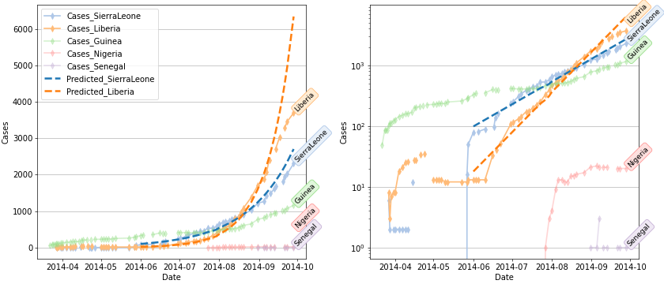

# Supplementary materials for a lesson plan for a math epidemiology project

This repository contains the following:
* `country_timeseries.json` -- a JSON file containing case and death data by country during the 2014 Ebola epidemic. This data is copied from https://github.com/cmrivers/ebola/tree/master/data_products
* `plot_bycountry.py` -- a Python script file which processes and visualizes this JSON file 
* `cases_bycountry.png` and `cases_bycountry.pdf` -- the resulting figure from the above script. 
* `cases_bycountry_small.png` -- small version for the README in this repository.
* `Plague_Commission_Report_Excerpt.pdf` is a selected excerpt of the 1908 Plague Commission report which students are asked to read. In this, the epidemiology 
of the plague in Colonial India is reported on. This would, in part, inspire the 1927 Kermack and McKendrick paper introducing an SIR model for epidemics. 

# Prerequisites for Python script
To run the python script successfully, one needs a modern version of Python 3 with the following packages installed:
* pandas 
* numpy
* matplotlib
* json
* datetime 

Depending on your environment (e.g. conda) most of these packages may come installed by default (especially the last two).
